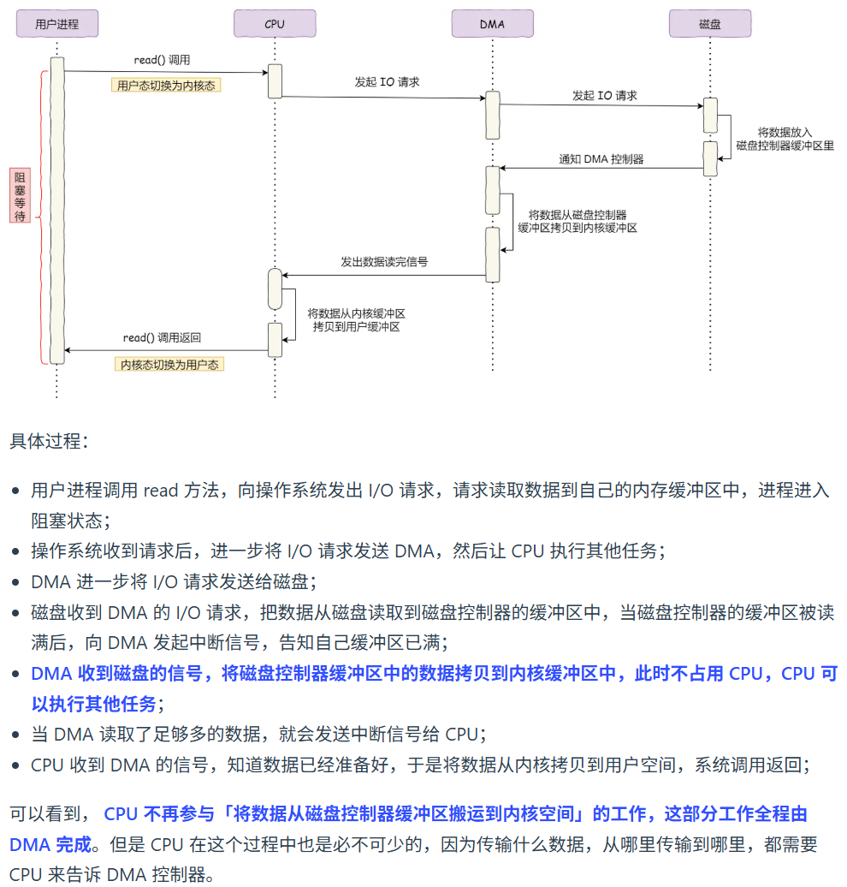

## 32 位与 64 位 CPU 的主要区别

- 区别在于寄存器位数的不同
- 进而影响寻址能力，32位的寄存器最大支持约 4 GB 内存（2³²），64位的理论支持 18 EB（2⁶⁴）这么大的内存
- 还会影响一次运算的数据量
- 指令集也不同 x86 x86-64

> 32 位与 64 位 os 是指的 指令字长

## 厂商跑分时为什么要超频

- 目的提高程序的CPU执行时间  = 指令数 * CPI * 时钟周期时间
- 指令数取决于编译器实现
- CPI （平均一条指令所需的时钟周期数）由于流水线技术 都差不多
- 时钟周期时间 = CPU主频的倒数 超频=>减小了时钟周期时间
- 问题：容易崩溃

## 虚拟内存有什么作用

- 虚拟内存可以看作是物理内存的拓展，他使得每个进程的运行内存可以超过物理内存的大小，因为程序符合局部性原理，CPU访问内存会有明显的重复访问的倾向性，对于暂时未使用到的内存，可以把他换出到物理内存之外，比如硬盘的swap区域
- 虚拟内存可以简化编程，它可以让程序员不用关心物理内存是否连续，程序一直看到的是一块连续的地址空间
- 虚拟内存可以解决多进程地址冲突问题，因为每个进程的虚拟内存空间是相互独立的，而且页表是私有的
- 虚拟内存支持内存保护，操作系统可以标记某段虚拟内存为只读、不可执行等状态，当程序越界访问时触发异常(segmentation fault)，从而防止恶意攻击
- 虚拟内存支持内存共享，多个进程的页表可以映射同一段物理内存(比如共享库、只读数据段)，从而节省内存

## 内存的分配过程

## 什么时候用互斥锁

- 互斥锁加锁失败后，线程会释放CPU给其他线程
- 会带来两次线程上下文切换成本（当线程加锁失败时、锁被释放时）
- 切换成本大概在几十纳秒到几微妙之间
- 如果锁住的代码执行时间比切换成本还要短，就应该选用自选锁，否则选用互斥锁

## CPU如何与设备控制器中的 寄存器和数据缓冲区 进行通信的？

- 端口I/O：每个控制寄存器被分配一个I/O端口，可以通过汇编指令来操作这些寄存器
- 内存映射I/O：将所有的控制寄存器映射到内存空间中，像读写内存一样读写数据缓冲区

## 当设备控制器读完数据的时候 怎么通知CPU？

- CPU轮询等待，一直查寄存器的状态，直到状态标记已完成
- 硬件中断
- DMA

## 介绍一下零拷贝技术 | 大文件传输该如何处理

https://www.xiaolincoding.com/os/8_network_system/zero_copy.html

